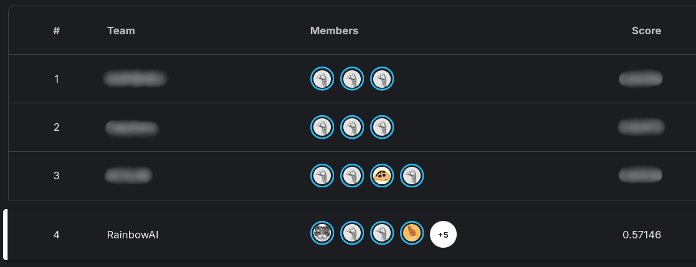

# A Clear Starting Point: A Reproducible Experimental Framework for the ICASSP 2026 Hyper-Object Challenge

We present a reproducible experimental framework for the ICASSP 2026 Hyperobject Challenge (Track 2), focusing on baseline engineering rather than architectural changes. Using the official organizer-provided baseline as a fixed reference, we standardize data handling, training and evaluation control, and experiment configuration to enable reliable comparison and rapid ablation. Our framework includes reproducible workflows, category-aware sampling, and practical I/O optimizations. Without modifying the baseline architecture, we achieve competitive performance (0.57146/SSC on the test-private split).

> Leaderboard snapshot (team: RainbowAI, test-private SSC = 0.57146):



> Hyperobject Challenge official repository: https://github.com/hyper-object/2026-ICASSP-SPGC

This repository contains:
- Complete reproducible tutorial (README)
- Config .yaml files
- CLI flags implemented
- (conferir) Conversion script .h5 -> .zarr
- (conferir) Code for SMOTE generation

## The Challenge - Track 2 summary (from the official challenge README)

This repository provides a **reproducible training/evaluation framework** for the **ICASSP 2026 Hyper-Object Challenge — Track 2 (SPGC GC7)**.

- **Input:** low-resolution RGB image captured with a commodity camera  
- **Output:** high-resolution hyperspectral cube with **C = 61** spectral bands and **spatial upscaling**  
- **Ranking metric:** **Spectral–Spatial–Color (SSC)** score in **[0,1]**
  - **Spectral:** SAM, SID, ERGAS
  - **Spatial:** PSNR, SSIM computed on a **standardized sRGB render** (D65, CIE 1931 2°)
  - **Color:** ΔE00 computed on the same standardized sRGB render

Official page: https://hyper-object.github.io/

---

## Tutorial — ICASSP 2026 Hyperobject Challenge (Track 2)
### 1. Setup

This section explains how to set up the environment to run the Track 2 baseline.

### 1.1. Create an environment

You should create **one isolated environment per model/experiment** to avoid dependency conflicts.

Pick either:

- [**Python venv:**](https://docs.python.org/3/library/venv.html) Lightweight and built into Python. Best when you only need Python packages and you already have a suitable Python version installed.
- [**Conda environment:**](https://docs.conda.io/) Manages the Python version and binary dependencies (compiled libraries), and is commonly adopted in academic/HPC setups. Follow your lab’s rules if they apply (e.g., some labs require Conda).

If you don’t have Conda installed yet, [**Miniconda**](https://docs.conda.io/projects/miniconda/en/latest/) is the minimal official installer and is a common choice.

Steps:
1. Create a environment (venv or conda) (recommended: one environment per model)
2. Activate the environment
3. Install the requirements

#### 1.1.1. Option 1: Create a Python virtual environment (venv)
> Commands below assume macOS/Linux.

> ```bash
> cd 2026-ICASSP-SPGC
> mkdir -p venvs
> # Create the virtual environment inside /venvs
> python3 -m venv baseline-env
> # Activate it
> source venvs/baseline-env/bin/activate
> ```

Note: this activation command assume a Bash-compatible shell. If you’re using a different shell (e.g., zsh, fish, PowerShell), use the appropriate activation command from [the official venv documentation](https://docs.python.org/3/library/venv.html#how-venvs-work).

#### 1.1.2. Option 2: Create a Conda environment

> ```bash
> # Create and activate an environment (here we are using Python 3.11)
> conda create -n baseline-venv python=3.11 -y
> conda activate baseline-env
> ```

If you installed conda but you get "command not found", you may need to initialize it for your shell (see [Conda docs](https://docs.conda.io/)). Example (common in some setups):
> ```bash
> # manually activate conda (path may differ)
> source ~/miniconda3/bin/activate
> ```

#### 1.1.3. (Optional) Quick checks
> ```bash
> # Show which Python you're using
> which python
> python --version
> # If using conda, list environments
> conda info --envs
> ```

### 1.2. Upload the data
- Upload the dataset into the `data/` folder.
- Put the Track 1/2 data inside subfolders named `track1` and `track2`.
- Rename the Track 2 public test folder from `public-test` to `test-public` (only if your dataset uses that folder name).

Therefore, the directory structure will be (only the folders above are shown):

```
2026-ICASSP-SPGC
    |-- data
        |-- track1/
            |-- train/
                |-- mosaic/
                |-- hsi_61/
            |-- test-public/
                |-- mosaic/
                |-- hsi_61/
            |-- test-private/
                |-- mosaic/
        |-- track2/
            |-- train/
                |-- rgb_2/
                |-- hsi_61/
            |-- test-public/
                |-- rgb_2/
                |-- hsi_61/
            |-- test-private/
                |-- rgb_2/
    |-- venvs   # somente se criado o venv do python
        |-- venv-baseline
```

**NOTE:** You may use a different folder than `data` to store the data; just pass `-d DATA_DIR` to the scripts, where `DATA_DIR` is the folder containing the data. The folder must still follow the structure above.

#### Extra data

Some additional “sub-datasets” were generated and may be required:

- `hsi_61_zarr`: Hyperspectral images compressed in a format that speeds up reading on HDDs.
The `train` split is available [here](https://drive.google.com/file/d/1VUhh06-X8rkoGVT9kgp1SkCEzK5VDNue/view?usp=sharing), and the `test-public` split is available [here](https://drive.google.com/file/d/1mYDPvYhqCs1fbDjPfItGDOuyOWf1_nvF/view?usp=sharing).
- `rgb_full`: RGB renderings generated from the 61-band images. These are used for TRevSCI pre-training. The `train` split is available [here](https://drive.google.com/file/d/15G-PIgDrjGClxsio5a-r68x0KlFBDsoL/view?usp=sharing) and the `test-public` split is available [here](https://drive.google.com/file/d/1A2xJ9eBADNx5hFru3gjNkqdws34Cp-Bp/view?usp=sharing).

The “sub-datasets” are the same for both tracks. If you are using Linux/Mac, you don’t need to download them twice—just create symlinks.
For example, if you have all datasets under Track 2, simply navigate to `data/track1/train/` and run:

```
ln -s ../../track2/train/hsi_61 .
ln -s ../../track2/train/hsi_61_zarr .
ln -s ../../track2/train/rgb_full .
```

Similarly, for `test-public`, navigate to `data/track1/test-public` and run:
```
ln -s ../../track2/test-public/hsi_61 .
ln -s ../../track2/test-public/hsi_61_zarr .
ln -s ../../track2/test-public/rgb_full .
```
Then, the structure for each track will be:
```
|-- track{1 or 2}/
    |-- train/
        |-- {mosaic or rgb_2}/
        |-- rgb_full/
        |-- hsi_61/
        |-- hsi_61_zarr/
    |-- test-public/
        |-- {mosaic or rgb_2}/
        |-- hsi_61/
        |-- rgb_full/
        |-- hsi_61/
        |-- hsi_61_zarr/
    |-- test-private/
        |-- {mosaic or rgb_2}/
```

### 1.3. Install repo requirements (after activating the environment)
Go to the folder where the `requirements.txt` file is located and run:
> ```bash
> pip install -r requirements.txt
> ```

---


### 2. Training the models

To train a model, run:

> ```bash
> python train.py --track TRACK --config PATH_TO_CONFIG
> ```

Where `TRACK` should be replaced with the track you want to use (2 for Track 2, 1 for Track 1) and `PATH_TO_CONFIG` is a configuration file path.

If no configuration is provided, the script will use the default baseline. For example, to train the Track 2 baseline, simply run:

> ```bash
> python train.py --track 2
> ```

- If you run into CUDA out-of-memory (OOM) issues, it may help to set: `PYTORCH_CUDA_ALLOC_CONF=expandable_segments:True`

#### 2.1. (Optional) Faster training
The `train_fast.py` enables faster training by loading inputs (light) and outputs (heavy) separately, and it also supports additional training schemes (for example, TRevSCI training requires this script).

Run:

> ```bash
> python train_fast.py --track TRACK --config PATH_TO_CONFIG
> ```

By default, it will automatically:
- Use `rgb_2`as the input for Track 2 (and `mosaic` for Track 1).
- Use `hsi_61_zarr` as the output target.

If you do **not** have `hsi_61_zarr` installed, you should use the flag `-o hsi_61`.
You can change:
- the input dataset with the flag `-i`
- the output dataset with `-o`.

For example, to train MST++ using `rgb_full` as input and predict `hsi_61`:

> ```bash
> python train_fast.py --config PATH_TO_CONFIG -i rgb_full -o hsi_61
> ```

You can also use `-s SEED` to make training runs reproducible (i.e., deterministic shuffles and transforms).

#### 2.2. (Optional) Alternative indexing for test data
With `train_fast.py`, you can specify an index file using `--index` listing the sample IDs to be used as the test dataset.
For example, `--index config/indexing/alt.txt` points to an index of 12 images (4 from each category).

---

### 3. Evaluating the model on `test-public`
> ```bash
> python evaluate.py --track TRACK --config PATH_TO_CONFIG --model path/to/model.tar
> ```

To validate a trained model, provide the configuration that was used for training and the saved checkpoint.

#### 3.1. (Optional) Faster evaluation
Similarly to `train_fast.py`, there is also `evaluate_fast.py`, which enables evaluation for alternative training pipelines such as TRevSCI.

> ```bash
> python evaluate_fast.py --track TRACK --config PATH_TO_CONFIG --model path/to/model.tar
> ```

Models trained with `train_fast.py` also save their configuration together with the model, so `--config` can be omitted. For example:
> ```bash
> python evaluate_fast.py --track TRACK --model runs/track1/blahblah/
> ```

---

### 4. Generating predictions for `test-private`
> ```bash
> python submission.py --track TRACK --config PATH_TO_CONFIG --model path/to/model.tar
> ```

You can change the output directory for the submission files with the `-o OUT_DIR` flag. By default, outputs are written to the `submission_files` folder.

**NOTE:** Models trained with the legacy/old scripts will not be compatible with the scripts above.
If you want to run a model trained with the old script, you need to apply the following change in the submission script:

```diff
-  model.load_state_dict(checkpoint["model"])
+  model.load_state_dict(checkpoint)
```

#### 4.1. (Optional) Faster prediction
To use models with the TRevSCI->MST++ pipeline, you must use the `submission_fast.py` script. The logic is the same as in `evaluate_fast.py`.

---

### 5. Adding a model
To add a new model:
1. Implement the model inside `models/`, following `example.py`.
2. Add a configuration for the model in `configs/`, starting from `CONFIG_TEMPLATE.yaml`.
3. In `models/__init__.py`, update the `setup_model` function to include the model setup, following the example in the file.

---

### 6. Generating synthetic data via SMOTE
This repo includes a **SMOTE-like** generator for Track 2 that creates **new (RGB, HSI)** pairs by **linear interpolation** between two real samples **from the same class**:

$$
x_{\text{syn}} = x_1 + \lambda (x_2 - x_1), \quad \lambda \sim U(0,1)
$$

It works on **both modalities** (HSI cube + RGB image) and saves the synthetic pair to disk.


#### 6.1. Create an environment for SMOTE

You can reuse your main environment, but for reproducibility and fewer dependency headaches we recommend a separate one:

> ```bash
> conda create -n smote-env python=3.11 -y
> conda activate smote-env
> pip install -r requirements.txt
> ```

Install the extra packages used by the SMOTE notebook:
> ```bash
> pip install h5py pandas matplotlib opencv-python
> ```

If you want GPU interpolation, install PyTorch with CUDA support (follow the [official PyTorch selector for your CUDA version](https://pytorch.org/get-started/locally/)). If you don’t, the notebook will still run on CPU.

#### 6.2. Open the SMOTE notebook
The SMOTE workflow is implemented in `smote.ipynb`. Run it with:
> ```bash
> pip install jupyter
> jupyter lab smote.ipynb
> ```

> Note: You can run it in JupyterLab, but you can also open the notebook in an IDE (e.g., VS Code / PyCharm) and execute it cell-by-cell there.

#### 6.3. Configure paths + output folder
Inside `smote.ipynb`, set the dataset paths:

> ```python
> BASE_TRAIN_DIR = r"/path/to/track2/train"
> BASE_TEST_DIR  = r"/path/to/track2/test-public"
> OUT_ROOT_DA    = r"./DataAugmentation"
> ```

The notebook writes outputs to:
```
|-- DataAugmentation/
    |-- labels_train.csv
    |-- labels_test-public.csv
    |-- smote_plan.csv
    |-- train/
        |-- hsi_61/
        |-- rgb_2/
    |-- test-public/
        |-- hsi_61/
        |-- rgb_2/
```

#### 6.4. How the SMOTE plan works (reproducible pairing)
The notebook first scans:
- `hsi_61/*.h5`
- `rgb_2/*` (must share the same basename as the `.h5`)

It generates metadata files:
- `labels_train.csv`
- `labels_test-public.csv`

Then it creates a pairing plan (`smote_plan.csv`) to balance classes within each split (train and test-public separately). For each class, it plans enough synthetic samples to match the largest class count in that split.

> Important: the pair selection is deterministic because the plan builder uses `random_state = 42` in `build_smote_plan_for_split()` function. So: the two source inputs (`id1`, `id2`) for each synthetic sample are fixed as long as you keep the same data and keep `random_state = 42`.


#### 6.5. Generating synthetic samples (one at a time)
Synthetic samples are large (HSI is resized to 1024×1024×61), so the notebook intentionally generates one synthetic pair per call to avoid GPU/CPU memory spikes.

Each generation step:
- loads the two originals (`id1`, `id2`)
- normalizes each HSI cube to [0, 1]
- resizes (HSI -> 1024×1024, RGB -> 512×512)
- interpolates (optionally on GPU)
- saves outputs
- runs cleanup (`del ...` and `gc.collect()`)

It also prints what it just generated (including the two source IDs) and can plot:
- original RGB for id1
- original RGB for id2
- synthetic RGB

**Naming schene**: each synthetic sample uses: `synthetic_id = f"{id_1}_{id2}"`
  and is saved as:
  - `DataAugmentation/<split>/hsi_61/<synthetic_id>.h5`
  - `DataAugmentation/<split>/rgb_2/<synthetic_id>.png`

To generate samples, run the final cell repeatedly:
```
generate_next_synthetic_from_plan(
    plan_path=SMOTE_PLAN_CSV,
    labels_train_path=LABELS_TRAIN_CSV,
    labels_test_path=LABELS_TEST_CSV,
    base_train_dir=BASE_TRAIN_DIR,
    base_test_dir=BASE_TEST_DIR,
    out_root_da=OUT_ROOT_DA,
    split_filter=None,     # or "train" / "test-public"
    show_plot=True,
    use_gpu_interp=True
)
```

> Example output when generating one synthetic pair (two originals on the left, synthetic on the right):


#### 6.6. Reproducibility note (what stays fixed vs what changes)
- Fixed (reproducible): which pairs are used `id1`, `id2`), because `smote_plan.csv` is built with `random_state=42`.
- Not fixed by default:  the interpolation factor $\lambda$ is sampled at generation time. So if you rerun generation without saving $\lambda$, the same `(id1, id2)` can produce slightly different synthetic samples. If you need strict determinism for the synthetic pixels, extend the plan to also store a `lambda` column and reuse it during generation.


#### 6.7. Required index file for SMOTE experiments

**How `--index` works (and why it prevents leakage):**  
When training a model, we usually split the data into two roles:

- **Training set:** the model *learns* from these samples.
- **Evaluation/validation set (e.g., `test-public`):** the model is *checked* on these samples, but it must **not learn from them**.

If we accidentally evaluate on samples that also appear in training, we get **data leakage**: the model is being tested on something it has already seen during learning.

With `train_fast.py`, the flag `--index PATH_TO_TXT` lets you explicitly define **which sample IDs are reserved for evaluation** (i.e., which samples will be used to validate the model). Think of it as a “reserved-for-evaluation” list.

- The index file is a plain `.txt` file.
- It contains **one sample ID per line** (matching the dataset filenames, usually without extension).

**Why this matters for SMOTE experiments:**  
SMOTE does **not** use `--index` to decide what to generate. You still generate synthetic samples normally.

The leakage risk comes *after* SMOTE: each synthetic sample is created from **two real samples** (`id1` and `id2`). Therefore, when choosing an evaluation subset, you must ensure that **no evaluation sample appears as a source (`id1` or `id2`) for any synthetic sample used in training**. In practice, this means you must check the SMOTE plan (and you can also check the filenames of the generated synthetic samples themselves, since they include `id1` and `id2`) and pick evaluation IDs that are not used by the training synthetic pairs.

To reproduce the SMOTE experiments in this repo without leakage, use the SMOTE-specific index file:

- `config/indexing/alt_smote.txt`

This file was prepared to match the default SMOTE plan seed (`random_state=42`). If you change the seed (or regenerate the SMOTE plan / dataset), you should regenerate/update the index file as well.


#### 6.8. Training with the SMOTE-augmented dataset

##### Step 1 — Create a “full” augmented dataset folder (original + synthetic)

After generating the SMOTE samples, you will have something like:

- original dataset (example): `path/to/data/track2/`
- synthetic outputs (from the notebook): `path/to/DataAugmentation/`

To train normally, it is recommended to create a **new dataset folder** that contains **all samples** (original + synthetic) organized in the same folder structure expected by the training scripts. In this tutorial, we call this folder data_da (short for data data augmentation). For example:

```
path/to/data_da/track2/train/rgb_2/
path/to/data_da/track2/train/hsi_61/
path/to/data_da/track2/test-public/rgb_2/
path/to/data_da/track2/test-public/hsi_61/
```

Where each folder contains both the original files and the synthetic ones (same naming conventions).

##### Step 2 — Reference the augmented dataset with `-d`, `-i`, and `-o`

When training with `train_fast.py`, point to your new augmented dataset root with `-d`, and explicitly set the input/output datasets:

- `-i rgb_2` (input)
- `-o hsi_61` (target)

##### Example command (Track 2 + augmented dataset + custom index)

```bash
python train_fast.py \
  --track 2 \
  --config path/to/config_da.yaml \
  -d path/to/data_da \
  -i rgb_2 \
  -o hsi_61 \
  --index path/to/2026-ICASSP-SPGC/config/indexing/alt_smote.txt
```

This will train using the augmented dataset under ```path/to/data_da```, and use the IDs listed in alt_smote.txt as the evaluation subset.

---

### 7. Weights & Biases
To log training runs to Weights & Biases (wandb), first log in with:
> ```bash
> wandb login
> ```

and paste you API key. Then add the `--use_wandb` flag when training, for example:
> ```bash
> python train.py --track TRACK --config PATH_TO_CONFIG --use_wandb
> ```

### Extras

#### A. Testing whether the GPU is being accessed correctly

- Type `python` in your terminal
- Run:
  - `import torch`
- Then check GPU availability with one of the commands below:
  - `torch.cuda.is_available()` — returns `True` if a CUDA-capable GPU is available and PyTorch can use it; otherwise `False`.
  - `torch.cuda.device_count()` — returns the number of available GPUs.
  - `torch.cuda.current_device()` — returns the index of the currently selected GPU.
  - `torch.cuda.get_device_name(device_id)` — returns the name of the GPU specified by `device_id`.
  - `torch.cuda.get_device_properties(device_id)` — returns properties of the specified GPU (e.g., memory, compute capability).
- Type `exit()` to return to the shell.

#### B. Keep `requirements.txt` up to date

Remember to update `requirements.txt` if you install additional Python packages (via `pip`).

#### C. Configuring Git

```bash
git config --global user.name "Your Name"
git config --global user.email "your.email@example.com"
